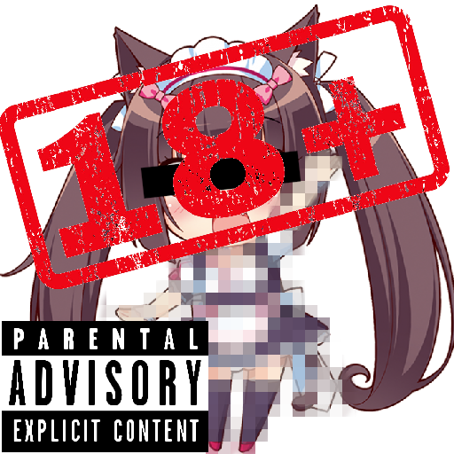

# Neko Fans Plugin for FFXIV 


**Displays a random Neko cat girl.**
(or an image from a different source)

This is a plugin to be used with the [FFXIVQuickLauncher](https://github.com/goatcorp/FFXIVQuickLauncher) and [Dalamud](https://github.com/goatcorp/Dalamud).

Inspired by [Nya](https://github.com/Sirspam/Nya) for Beat Saber.

## Installing

<details><summary>Click here for a video tutorial</summary>
<p>


</p>
</details>

Enable "Get plugin testing builds" in the experimental settings of Dalamud, or
add this as a custom plugin repository in the experimental settings:

```url
https://raw.githubusercontent.com/Meisterlala/NekoFans/master/repo.json
```

You can also download a specific version on the [release page](https://github.com/Meisterlala/NekoFans/releases) and install it manually. Unzip the downloaded file and add the folder to "Dev Plugin Locations" in the experimantal settings.

## NSFW Images 

By default you can only view Safe for Work (SFW) images.

Installing the **Neko Fans NSFW 18+ Patch** Plugin will give you full access to all the images each API provides. This Patch is not in the offical Dalamud plugin repository and needs to be installed separately by adding a custom plugin repository (see [above](#installing)).

## Usage

To use the plugin, you must have launched the game via [XIVLauncher](https://github.com/goatcorp/FFXIVQuickLauncher).
Then, all you need to do is type `/neko` in the in game chat to open the main window.

Everytime you click on the image, a new one will appear.

You can change to look and feel of the plugin in the Configutaion Menu, which can be opened by typing `/nekocfg` in the game chat or by clicking the ⚙ in the Plugin installer. You can choose the API, which provides the Images in the Configuration Menu.

## Supported APIs

- [Catboys](https://catboys.com/)
- [Dog CEO](https://dog.ceo/dog-api/)
- [Nekos.life](https://nekos.life/)
- [Pic.re](https://pic.re/)
- [shibe.online](https://shibe.online/)
- [The Cat API](https://thecatapi.com/)
- [WAIFU.IM](https://waifu.im/)
- [Waifu.pics](https://waifu.im/)
- [Twitter](https://twitter.com/)
